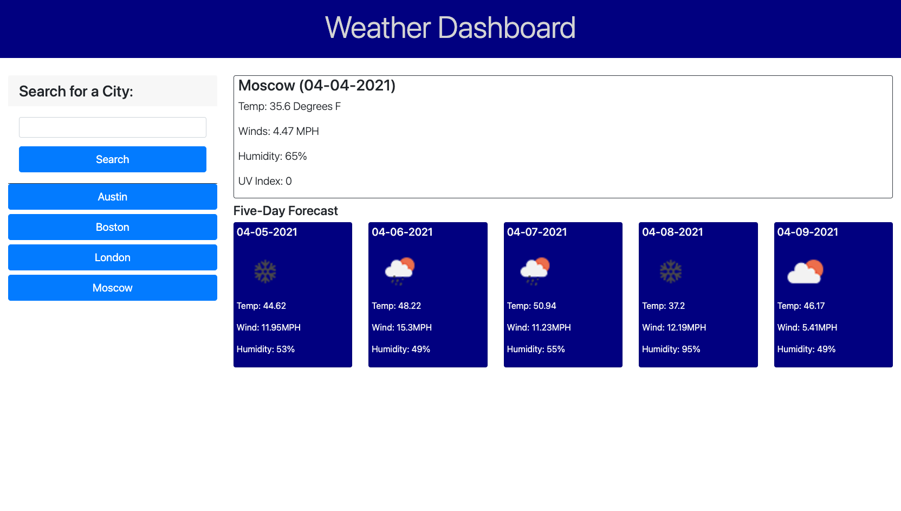

# weather-dashboard
Weather Dashboard is an application that displays the current conditions and 5-day forecast for a city of the user's choice.  The informatoin is displayed after the user enters a city's name into the search field, clicks the search button or hits return.  In addition, the user can select from a list of previously entered cities.

## Link to Deployed Application

https://swillrich5.github.io/weather-dashboard/

## GitHub Repository

https://github.com/swillrich5/weather-dashboard

# Requirements

Weather-Dashboard has the following requirements:

* The application must pull data from OpenWeather's Weather API.
* After a user inputs a city name, current and future weather considtions are displayed for that city.  

* Current conditions to be displayed include:

  * City Name
  * Current Date
  * An icon representation of the current weather conditions
  * Temperature
  * Humidity
  * Wind Speed
  * UV Index

* Future conditions are to be displayed for the next five days.  The data to be displayed should include:

  * The date of the future forecast
  * An icon representation of the predicted weather conditions
  * Forecast temperature
  * Forecast wind speed
  * Forecast humidity

* The cities that the user has search for should be saved to local storage.

* Each previously searched-for city should be displayed on the screen in a way that allows the user to display the current weather and forecast by clicking on the city's name.  Cities searched for in prior uses of the application should be displayed as well.

## Application Image

Application Screenshot

## Technologies in Use

The weather-dashboard was built using:

  * HTML 
  * Bootstrap 
  * css 
  * Javascript, and 
  * The Open Weather API